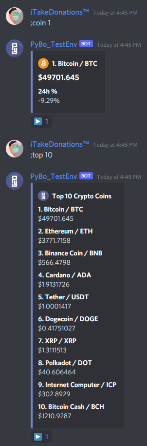

# Table of contents
- [General Info](#general-info)
- [Local Installation](#local-installation)
- [Current Features](#current-features)
- [Technologies](#technologies)

# Pybo Cryptocurrency Discord Bot
If you want to see the bot in action and play around with it, you can [join here!](https://discord.gg/6YCm7mSPDu)

## Local Installation

### Requirements:
[Python](https://www.python.org/downloads/ "Python Download Page")  
[PostgreSQL](https://www.postgresql.org/download/ "PostgreSQL Download Page")

## Current Features
- Cryptocurrency tracker that displays the top 100 coins

## License
[MIT](../LICENSE) © 2021 AnotherCreator

